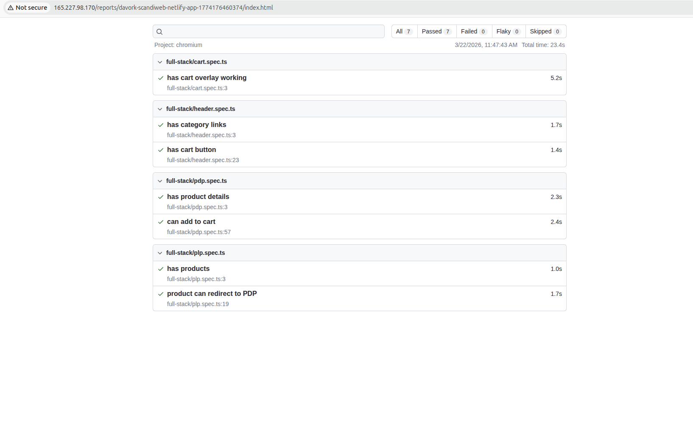

# Scandiweb Assignment

Welcome to my repository for the Scandiweb Junior FullStack Test Assignment.

## 🌐 Live Demo
👉 [https://davork-scandiweb.netlify.app/all](https://davork-scandiweb.netlify.app)

## 🚀 Tech Stack

### Frontend
- **React 19**: Utilizing the latest React features for efficient rendering.
- **Vite**: Ultra-fast build tool and development server.
- **TypeScript**: Ensuring type safety and better developer experience.
- **React Router DOM**: Advanced client-side routing.
- **Vanilla CSS**: Kept the stack light and dependency-free, focusing on clean, maintainable styles for a faster UI.

### Backend
- **PHP 8.0+**: Robust and reliable server-side execution.
- **GraphQL (webonyx/graphql-php)**: Flexible API for efficient data fetching.
- **PDO**: Standard PHP database abstraction layer.
- **vlucas/phpdotenv**: Environment variable management.
- **Composer**: Dependency management for PHP.

---

## 🛠️ Setup & Installation

### Backend Setup
1. Ensure you have PHP 8.0 or higher installed.
2. Install Composer if you haven't already.
3. Run `composer install` in the project root to install backend dependencies.
4. Set up your database (MySQL) and import the `data.sql` file to create the necessary tables.
5. Create a `.env` file in the root directory based on `.envexample` and configure your database credentials.
6. Run the data import script via CLI to populate the database:
   ```bash
   php scripts/import.php
   ```
7. Start your PHP server with the document root set to `public/`:
   ```bash
   php -S localhost:8000 -t public
   ```

### Frontend Setup
1. Navigate to the `frontend/` directory.
2. Run `npm install` to install frontend dependencies.
3. Run `npm run dev` to start the Vite development server.
4. Access the application at `http://localhost:5173`.

---

## 🏗️ Architecture Decisions

### Why this stack?
- **React Context API**: Used Context API to keep state management lightweight and intuitive, skipping the setup complexity while maintaining global state accessibility.
- **Performance First**: Split-chunking (manual chunks) and lazy loading are implemented to improve initial load and the app performance.

### Folder Structure Reasoning
The project is split into two main sections:
- **`src/` (Backend)**: Contains the PHP logic.
  - `Models/`: Domain entities and data logic.
  - `Resolvers/`: Logic that bridges GraphQL queries to the Models.
  - `Controller/`: Entry point (GraphQL handler).
  - `Factories/`: Responsible for instantiating complex model objects.
- **`frontend/src/` (Frontend)**:
  - `components/`: Reusable UI elements (ProductCard, CartItem, etc.).
    - Note: Complex components like **`CartOverlay`** include their own localized **`context/`** to keep state logic closer to the UI, making it modular and easier to debug.
  - `pages/`: High-level views (CategoryPage, ProductDetails).
  - `services/`: API interaction layer.
  - `graphql/`: GraphQL query definitions.
  - `types/`: Global TypeScript definitions.
  - `utils/`: Shared helper functions and custom hooks
   

---

## 🧠 State Management Approach

We use **React Context API** combined with the **`useReducer`** hook for global state. This allows for predictable state transitions without the complexity of external libraries.

- **CartContext**: Manages the shopping cart, including adding/removing items, updating quantities, and persisting attribute selections (like size and color). Data is persisted in **`localStorage`** for a seamless user experience across sessions.
- **NotificationContext**: Lightweight feedback loop to keep users informed during the ordering process, ensuring clear communication for every success or failure.

## 🧪 QA Automation Test
